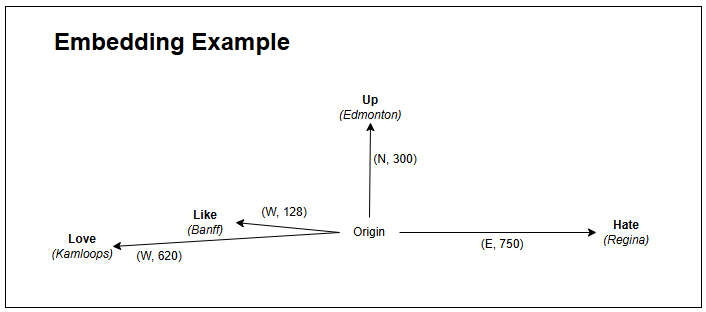

# Embedding Matchmaking

_"Words can't describe how unique your interests are... but coordinates can" - Sean Ashley, circa 2023_

A flattened embedding space of names clustered based on their interests using the sentence-transformers all-MiniLM-L6-v2 model. Created for the UW Startups S23 Kickoff event with guidance from [Jacky Zhao](https://jzhao.xyz/) and [Sean Ashley](https://www.linkedin.com/in/sean-ashley). [Simha Kalimipalli](https://github.com/Simha-Kalimipalli) later aded interactivity!

## Instructions for use

1. Collect or format your data in the following format

| Name  | What are your interests? (or varying permutations of this question) |
| ----- | ------------------------------------------------------------------- |
| Alice | I love being the universal placeholder for every CS joke ever       |
| Bob   | I too love being the universal placeholder for every CS joke        |

2. Clone the repository
3. Install all required packages using pip or conda:

- `umap-learn`
- `scikit-learn`
- `scipy`
- `sentence-transformers`
- `matplotlib`
- `pyvis`
- `pandas`
- `numpy`
- `seaborn`
- `branca`

4. Replace `attendees.csv` in `visualizer.ipynb` with the path to your downloaded data
5. Run all cells
6. Bask in the glory of having an awesome new poster
7. Make two (!) cool interactive visualizations

## What are Embeddings?

Embeddings represent words or sentences in a way that computers can understand and process, enabling them to use language like humans. Unlike humans, for whom words carry intuitive meaning, computers see words as mere sequences of characters (e.g., "iklvnmlrek," "23kj420," "!@#$%$%"). Since, computers don't have any sense of meaning of words they cannot really understand what those sequence of characters mean or how they are related to each other. Embeddings provide a mathematical representation that helps computers relate words to each other and derive meaning out of them.

To visualize embeddings, imagine them as points on a map. Instead of storing words as letters, embeddings convert them into numerical patterns (like coordinates) that reflect relationships. For instance, "like" and "love" are close, while "love" and "hate" are opposites.

Lets try to convert some words into embedding-like representation so we can understand the concept better. With Calgary as the origin, imagining the word "like" as Banff, "love" as Kamloops, "hate" as Regina and the word "up" as Edmonton they can be represented as the following:
    
    * like --> Banff(West, 128km)
    * love --> Kamloops(West, 620km)
    * hate --> Regina(East, 750km)
    * up --> Edmonton(North, 300km)

Here Banff and Kamloops are both west while Regina is east, the computer understands that "like" and "love" are similar but "love" is stronger while "hate" is completely opposite. The distance from the origin represents intensity. Similarly, the word "up" would be positioned north of Calgary (e.g., Edmonton) because "up" is a direction, whereas "like," "love," and "hate" are emotions. "Hate" is the negative of "like," but "up" is neither similar nor opposite—it exists in a separate dimension and hence a computer understands up is unrelated to the others. 

In the classmates.csv file, there are a number of interests posted by different people. When a computer processes those sentences by using embeddings, it can map entire sentences into a numerical space where similar sentences are closer together and unrelated sentences are farther apart. By getting these numeric coordinates for sentences (also known as Sentence Embeddings) it is now possible to tell whose interests are closer while whose interests are not similar.

For example: From classmates.csv file, Sudeep likes watching movies (similar to Amit and Thoufiq) so they would have similar/close coordinates however Thoufiq and Amit both like "Playing Cricket" so they would have more similar coordinates than Sudeep with them. Louise on the other hand likes reading (which is similar to Amit and Sudeep) so Louise, Amit and Sudeep would be closer in that sense. However Louise likes baking as well which is dissimilar all the three. So Sentence embeddings would capture all these relations and then provide coordinates to Amit, Louise, Sudeep and Thoufiq showing how similar/dissimilar their interests are.  

This is also exactly what we aim to do in this project: use embeddings to analyze classmates.csv and group people with similar interests based on the distances between their sentence embeddings.

## Data Analysis

To analyze the impact of sentence modifications on embeddings, we selected three sentences and made both **minor** (synonym replacement) and **major** (sentence restructuring) changes. We then computed the cosine similarity between the original and modified embeddings to assess how much the meaning was affected.

### Changes Made:
| Name                     | Original Description | Modified Description |
|--------------------------|----------------------|----------------------|
| **Sudeep Raj Badal**  | "I like listening to music, reading, going on long drives and watching movies." | "Exploring new places on long drives, immersing myself in books, and enjoying music and films are my favorite pastimes." |
| **Mohammed Abdul Thoufiq**  | "I like watching movies, playing cricket, efootball and collecting sneakers." | "I have a passion for cricket and gaming, enjoy collecting sneakers, and love immersing myself in great films." |
| **Louise Fear**  | "I like reading, playing video games, and baking." | "Baking, reading books, and playing video games are my favorite hobbies." |

### Results:
| Name                     | Cosine Similarity |
|--------------------------|------------------|
| **Sudeep Raj Badal**     | **0.7096** (Significant change) |
| **Mohammed Abdul Thoufiq** | **0.7868** (Moderate change) |
| **Louise Fear**          | **0.8755** (Minimal change) |

### Insights:
1. **Minor wording changes (synonyms, slight rephrasing) resulted in high similarity (~0.87).**  
   - Example: "playing video games" → "enjoying video games" had minimal impact.  

2. **Sentence restructuring had a moderate effect (~0.78).**  
   - Example: "watching movies, playing cricket, efootball, and collecting sneakers" → "passion for cricket and gaming, enjoy collecting sneakers, and love immersing myself in great films" introduced new structure but kept core ideas.  

3. **Conceptual shifts caused the largest changes (~0.70).**  
   - Example: "going on long drives" → "exploring new places on long drives" changed the meaning enough to significantly alter the embedding representation.  

The results indicate that while embeddings are resistant to minor rewording, **structural modifications and conceptual changes significantly impact similarity scores**. This is crucial for applications like clustering, retrieval, and text classification, where sentence meaning must be preserved.

## Embedding Sensitivity Tests
We tested two sentence embedding models, all-MiniLM-L6-v2 and all-mpnet-base-v2, to see how differently they measure similarity based on personal descriptions. While both models give similar overall rankings, they sometimes change the order of who is most similar.

### My Description:
"I like watching movies, playing cricket, eFootball, and collecting sneakers."

### Quantitative Analysis:
The two models mostly agree, but there are differences. For example, Ethan Cooke was ranked 3rd by Model 1 but dropped to 8th in Model 2. Meanwhile, Somto Muotoe moved up from 11th to 3rd, and Sriram Ramesh improved from 8th to 4th. This suggests that each model picks up on different aspects of similarity.

### Qualitative Observations:
Model 2 (all-mpnet-base-v2) seems to understand deeper connections, changing who is considered more similar. For example, Somto Muotoe (who likes reading, cycling, and video games) was ranked low in Model 1 but much higher in Model 2, likely because Model 2 connects multiple interests better. On the other hand, Ethan Cooke (who enjoys hiking and board games) dropped in ranking, suggesting that Model 1 (MiniLM) may have focused more on individual words rather than overall meaning.

These differences show that choosing the right model matters. While both models give similar results, small ranking changes can affect how we group people based on their interests.

## Dimension Reduction analysis
In the original model, the visualizations were highly sensitive to the random seed, with significant shifts in the 2D UMAP space as the seed changed. This instability suggests that the initial model was not robust, particularly with the small dataset, and highlights the impact of random initialization on the results.

After optimizing the parameters using Optuna, the tuned model demonstrated more stability in the visualizations, though the Spearman correlation values still varied slightly across seeds (Seed 42: 0.3629, Seed 10: 0.2201, Seed 20: 0.1957, Seed 30: 0.2176). The tuned visualizations were more consistent, with individuals sharing the same interests grouped together. However, there was still some shifting in the 2D space when changing the seed, indicating that UMAP generally clusters based on shared interests but remains sensitive to seed variation.

Regarding the tuned model, it successfully grouped individuals with exactly the same interests, such as those who mentioned biking, hiking, swimming. However, it struggled to differentiate between semantically similar phrases like “I love biking” and “I love cycling” This suggests that while UMAP is effective at capturing broad patterns in the data, it has limitations in understanding subtle language differences. 

The optimization process involved careful parameter tuning for n_neighbors, spread and min_dist, these parameters were chosen because they directly affect clustering tightness, local vs global structure, and the overall density of data, which are key factors in improving UMAP performance. We didn't tune the metric because cosine similarity was already a good fit for capturing semantic relationships between sentence embeddings and was sufficient for our needs.
